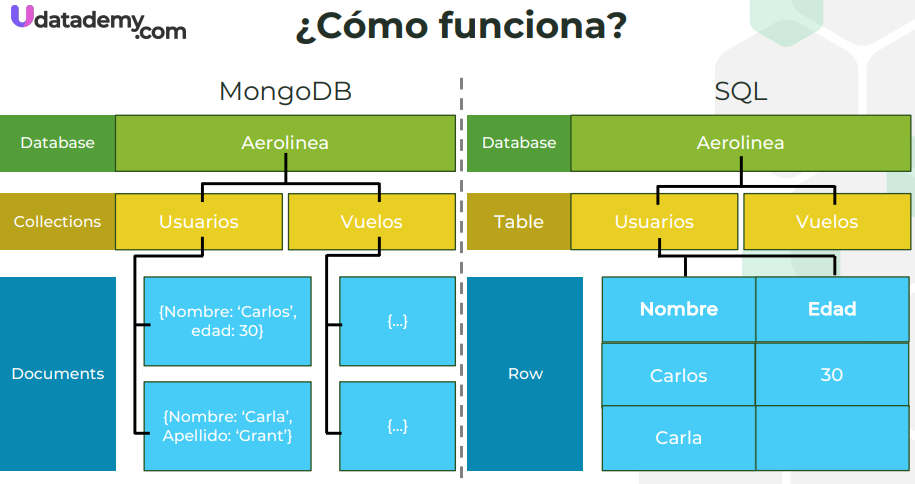
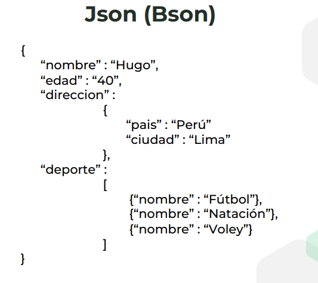

# SECCION 1

# 1. Presentación del curso

# 2. Regalo de bienvenida

# 3. Requisitos

# 4. Conoce www.udatademy.com

# 5. Mejorando la experiencia al desarrollar el curso

# 6. Base de datos sql vs base de datos no sql

**Bases de Datos SQL (Relacionales)**

SQL (Structured Query Language) es el lenguaje estándar utilizado para interactuar con bases de datos relacionales. Estas bases de datos organizan los datos en tablas que están relacionadas entre sí mediante claves (primary keys y foreign keys).

**Características principales:**

    - Estructura rígida: Los datos se organizan en tablas con esquemas predefinidos. Cada tabla tiene columnas con tipos de datos específicos y reglas sobre cómo deben ingresarse los datos.
    - Consultas complejas: SQL permite realizar consultas muy complejas utilizando joins, subconsultas, agregaciones, entre otras.
    - Transacciones ACID: SQL garantiza las propiedades ACID (Atomicidad, Consistencia, Aislamiento, Durabilidad), lo que asegura que las transacciones sean confiables y consistentes.
    - Normalización de datos: En general, se intenta minimizar la redundancia de datos mediante la normalización.

**Ejemplos de bases de datos SQL:**

- MySQL
- PostgreSQL
- Microsoft SQL Server
- Oracle Database
- SQLite
- IBM DB2
- MariaDB

**Ventajas:**

    - Ideal para aplicaciones que requieren consistencia y precisión.
    - Soporte para consultas complejas.
    - Amplia adopción y soporte por parte de la comunidad.

**Desventajas:**

    - Escalabilidad vertical: las bases de datos relacionales suelen escalar mejor aumentando la capacidad del servidor (más CPU, RAM, etc.), en lugar de distribuir la carga entre varios servidores.
    - Estructura rígida: la modificación del esquema es más difícil y puede interrumpir la aplicación.

**Bases de Datos NoSQL (No Relacionales)**

NoSQL abarca una variedad de tipos de bases de datos que no usan un modelo relacional basado en tablas. Estos sistemas son más flexibles y están diseñados para gestionar grandes volúmenes de datos distribuidos.

**Características principales:**

- Estructura flexible: No requieren un esquema fijo. Los datos pueden almacenarse en diferentes formatos, como documentos, gráficos, columnas o pares clave-valor.
- Escalabilidad horizontal: Son diseñadas para escalar horizontalmente, lo que significa que pueden distribuirse entre múltiples servidores para manejar grandes volúmenes de datos.
- Modelo BASE: No garantizan consistencia inmediata como SQL, sino que utilizan el modelo BASE (Básicamente Disponible, Estado Suave, Consistencia Eventual), lo que significa que los datos pueden no estar completamente consistentes en todos los nodos instantáneamente, pero eventualmente lo estarán.
- Alta disponibilidad: Suelen ser altamente disponibles y eficientes en entornos distribuidos, siendo ideales para aplicaciones en la nube.

**Tipos de bases de datos NoSQL:**

- Documentos: MongoDB, CouchDB (almacenan datos en formato JSON o BSON).
- Clave-Valor: Redis, DynamoDB (datos como pares clave-valor).
- Columnas: Apache Cassandra, HBase (almacenan datos por columnas en lugar de filas).
- Grafos: Neo4j, ArangoDB (gestiona datos que tienen relaciones complejas).

**Ventajas:**

    - Flexibilidad en la estructura de los datos.
    - Escalabilidad horizontal, lo que facilita el manejo de grandes volúmenes de datos.
    - Mejor rendimiento en operaciones de lectura y escritura para datos no estructurados.

**Desventajas:**

    - No todas soportan consultas tan complejas como SQL.
    - Menor consistencia inmediata, lo que puede ser un problema en aplicaciones críticas.
    - Puede haber fragmentación entre diferentes tipos de bases de datos NoSQL, lo que dificulta la selección correcta.

**Cuándo usar SQL o NoSQL**

- SQL es más adecuado para aplicaciones que requieren transacciones complejas, integridad de datos y donde la consistencia es crítica, como sistemas financieros o CRM.
- NoSQL es más adecuado para aplicaciones que manejan grandes volúmenes de datos sin estructura fija o cuando se requiere escalabilidad horizontal, como redes sociales, big data o aplicaciones en tiempo real.

# 7. Tipos de base de datos NoSQL

**Bases de Datos NoSQL de Tipo Documentos**

Este tipo de base de datos almacena los datos como documentos, que son estructuras semiestructuradas generalmente en formato JSON, BSON o XML. Los documentos pueden contener diferentes tipos de datos y permiten una gran flexibilidad en la organización de la información.

**Casos de uso:**

- Sistemas de gestión de contenido (CMS): Donde los datos tienen una estructura flexible que puede cambiar con el tiempo.
- Aplicaciones web con datos estructurados complejos: Por ejemplo, tiendas en línea que almacenan información sobre productos con descripciones, imágenes, comentarios, etc.
- Aplicaciones móviles: Que requieren un almacenamiento rápido y flexible para datos semiestructurados.

**Bases de Datos NoSQL de Tipo Clave-Valor**

Las bases de datos de tipo Clave-Valor son uno de los tipos más simples de bases de datos NoSQL. Almacenan los datos como pares clave-valor, donde cada clave es única y se asocia directamente con un valor. Este valor puede ser un objeto simple (como una cadena o un número) o una estructura de datos más compleja.

**Casos de uso:**

- Caché de aplicaciones web: Donde se almacenan datos temporales, como resultados de consultas de bases de datos o sesiones de usuarios.
- Sistemas de configuración: Almacenan configuraciones y preferencias de usuarios o de la aplicación.
- Sistemas de identificación de usuario: Cuando necesitas buscar rápidamente datos de usuario mediante una clave única, como un ID o nombre de usuario.

**Bases de Datos NoSQL de Tipo Columnas**

Las bases de datos de columnas están diseñadas para manejar grandes cantidades de datos distribuidos en múltiples servidores, pero a diferencia de las bases de datos relacionales tradicionales que almacenan datos por filas, estas bases de datos almacenan los datos por columnas. Son muy eficientes para operaciones que implican la lectura de grandes cantidades de datos para un número limitado de columnas.

**Casos de uso:**

- Análisis de big data: Empresas que manejan grandes volúmenes de datos, como en análisis de registros de eventos o información de usuarios, pueden beneficiarse de las bases de datos basadas en columnas.
- Sistemas de recomendación: Las bases de datos de columnas pueden gestionar grandes cantidades de datos históricos y utilizarlos para hacer recomendaciones rápidas.
- Almacenamiento de datos en tiempo real: Servicios que necesitan almacenar y procesar datos en tiempo real, como análisis de clics o monitoreo de dispositivos IoT.

**Bases de Datos NoSQL de Tipo Grafos**

Las bases de datos de grafos están diseñadas para gestionar datos que están altamente interconectados, donde las relaciones entre los datos son tan importantes como los propios datos. Utilizan una estructura de grafo, donde los nodos representan las entidades (como personas o productos) y los arcos o aristas representan las relaciones entre ellas.

**Casos de uso:**

- Redes sociales: Modelan perfectamente las relaciones entre usuarios, como amigos, seguidores o intereses compartidos.
- Recomendaciones personalizadas: Utilizan relaciones entre usuarios y productos para ofrecer recomendaciones más relevantes.
- Detección de fraudes: En sistemas financieros, se puede usar un grafo para detectar patrones inusuales o conexiones entre transacciones sospechosas.
- Sistemas de rutas y logística: Son útiles para encontrar la ruta más corta o más eficiente en redes de transporte o telecomunicaciones.

# 8. ¿Que es MongoDB?



**Lado MongoDB:**

- Database (Base de Datos): "Aerolinea" - Representa la base de datos que contiene todas las colecciones.
- Collections (Colecciones): "Usuarios" y "Vuelos" - Son equivalentes a las tablas en una base de datos SQL, pero más flexibles en términos de esquema de datos.
- Documents (Documentos): Dentro de la colección "Usuarios", se muestran ejemplos de documentos que pueden tener estructuras diferentes. Uno tiene "Nombre: 'Carlos', edad: 30", mientras que otro tiene "Nombre: 'Carla', Apellido: 'Grant'". Esta flexibilidad es una característica clave de las bases de datos de documentos.



La imagen muestra un ejemplo de un documento en formato JSON (JavaScript Object Notation), que es muy similar a BSON (Binary JSON) utilizado por MongoDB. Este formato es típico en las bases de datos de documentos NoSQL donde la estructura de los datos puede ser jerárquica y no uniforme entre diferentes documentos dentro de la misma colección. 

**Estructura de un JSON**

JSON es un formato ligero de intercambio de datos, fácil de leer y escribir para humanos, y fácil de parsear y generar para máquinas. Su estructura se deriva de la manera en que se construyen los objetos en JavaScript, aunque hoy en día se utiliza en muchos lenguajes y tecnologías debido a su simplicidad y eficacia en la representación de estructuras de datos. Un JSON puede contener:

1. Objetos: Un objeto JSON se representa mediante llaves {} y contiene un conjunto de pares clave-valor. Las claves son cadenas de texto, y los valores pueden ser cadenas, números, objetos, arrays, booleanos o null. 

Ejemplo:

```JSON
    {
    "nombre": "Ana",
    "edad": 25,
    "estudiante": true
    }
```

2. Arrays: Un array JSON se representa mediante corchetes [] y es una lista ordenada de valores (que pueden ser de cualquier tipo, incluyendo otros objetos o arrays). Ejemplo:

Ejemplo:

```JSON
    ["manzana", "naranja", "plátano"]
```

3. Valores: JSON admite cadenas (strings), números (integers y floats), objetos, arrays, booleanos (true y false), y null.